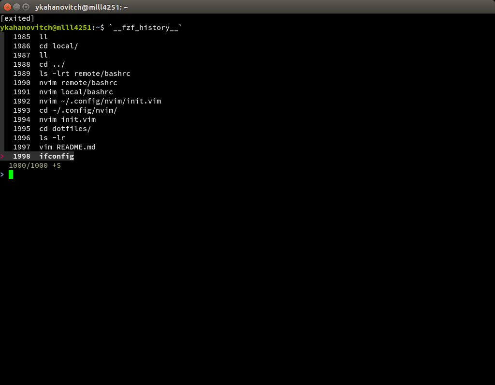
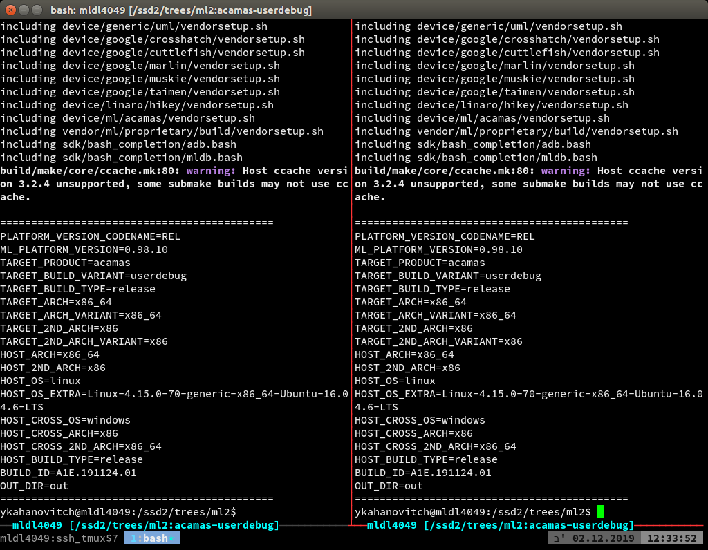

# Yaron's dofiles

## Get my configuration files
get my configuration files and place them under your home directory
you will need that repository both on your local host and remote server.
`cd ~ && git clone https://github.com/yaronkh/dotfiles.git`

## Install adobe "souce code pro" fonts
Those fonts are required only on your local host. You don't need to install them on a remote server

1. download the "source code pro" true type fonts files:
 `cd <download font directory> && git clone https://github.com/adobe-fonts/source-code-pro`

1. install ttf fonts by using gnome file manager or kde font install utility.
 *fonts are under <download font directory>/ttf*

## Install alacritty and arm it with my configuration files
alacritty is a super fast and flexible terminal.
Install alacritty only on your local host

1. install alacritty. You can do it by download the source code or install with yum
 `yum install alacritty`
 *my alacritty version: 0.3.3*

1.  copy my configuration files
`cp -r ~/dotfiles/alacritty ~/.config/`

1. make alacrity your default terminal on gnome the command is:
`gsettings set org.gnome.desktop.default-applications.terminal exec alacrrity`

## Install fzf (fuzzy finder)
you need to install fzf on local and remote machine.
don't install it as root. You will need to access fzf bash files

1. Download and install
```
$ git clone --depth 1 https://github.com/junegunn/fzf.git ~/.fzf
$ cd ~/.fzf/
$ ./Install`
```

1. add the following line to your .bashrc file:
 `[ -f ~/.fzf.bash ] && source ~/.fzf.bashrc`

1. open terminal and make sure that `CTRL-r` and `CTRL-t` works

## Install tmux
tmux is a terminal multiplexer.
You will need to install tmux on the remote server and launch it automatically from
your .bashrc file


1. install tmux. Note that I wrote the tmux configuration files for tmux next-3.1
If you are working with tmux 2.x, you are going to get error messages that refer to my configuration files
I strongly recommend to download tmux source and compile it.
You will need to install tmux on your remote machine

1. After installing tmux, copy my tmux configuration file:
 `cp ~/dotfiles/tmux.conf ~/.tmux.conf`

1. make sure that you have xclip on the station that runs tmux.

1. In order to use my script (``CTRL-b` `` `CTRL-bv` and `CTRL-bm`) make sure that you have python3.x and pstree.
 you can use yum to install those utilities

1. Add the following lines to your  ~/.bashrc file:
```
if [[ -z "$TMUX" ]] && [ "$SSH_CONNECTION" != "" ]; then
    if [ -z "$DISPLAY" ]; then
        echo "X DISPLAY not available"
        sleep 3
    fi
    [ -f ~/.fzf.bash ] && source ~/.fzf.bash
    export session=$(tmux list-sessions -F "#{session_id}" | sort -n | tail -1 2>/dev/null)
    tmux new-session -s "ssh_tmux$session"
    exit
fi
```

1. Make sure that tmux is launched correctly, open and new terminal
and make sure that you see this:


1. If you want to add smart title to your pane (for example to print a value of envirnment var)
you can set PS1 var in your .bashrc.
for example the following line will print the host name to the pane title:
`PS1="\[\033]2$PWD\033\033k$(hostname)\]$PS1"`

## Install neovim (nvim)
Install neovim (nvim) on the remote machine.
All my customization files for nvim are simple and should run even on old versions of nvim

1. the following utilities are used by my nvim configuration so make sure that
those utilities are available or install them via yum:
 silversearcher-ag exuberant-ctags cscope global codesearch
 take a look at the function ZInstall in ~/dotfiles/nvim/init.vim

1. install neovim-remote (neovim nvr utility is required)

1. copy my nvim  confi files to your .config directory:
`cp -r ~/dotfiles/nvim ~/.config/`

1. open nvim and run:
`:PlugInstall`

1. exit and run nvim again:

1. you might want to change the line
`let g:linuxsty_patterns = [ "/kernel/", "/linux/"]`
this list holds a set of regular expression used to detect kernel code repository

## Install tmux-neovim customization scripts:

1. verify python version (python3.x is required):
`python --version`

1. Verify that python module "psutil" is installed:
`python -c "import psutil" && echo "psutil installed"`

## Quick tour

1. open a new terminal. If you have configured alacritty on you local machine
you should see a black teminal:


1. lets try fzf history by pressing `CTRL-r`


1. ssh to your remote machine:
`ssh -X mldl4049`


1. create a new pane by pressing `CTRL-b%`


1. close the newly created pane (CTRL-D), cd to a git repository and launch nvim
   index the repository by pressing `\zg`
   If you have a large repo you can press ``CTRL-b` `` and see the hierarchy of processes


1. close the csope window by pressing `CTRL-Ww`
Now we can open a source file by pressing `CTRL-p`


1. place the cursor over a symbol and press `\cc`
 a pop-up will show all the places where this symbol is used


1. to open a new tab in nvim: `\t`

1. to select a buffer in nvim: `\<enter>`


1. to get the list of all symbols in project (via ctags) press `CTRL-n`

1. to toggle 'ide mode' press `CTRL-l`


1. to get a selection menu with all the symbols in the current buffer press `F3`


1. to get a list of all the commands that I have added to nvim press `\?`


1. to get the list of all commands in tmux press `CTRL-b?`


1. to select any buffer in *any opened vim* press `CTRL-bv`


1. to move buffers between vims press `CTRL-bm`


 1. tmux cheat sheel: [ https://tmuxcheatsheet.com/ ]

 1. learn vim the hard way: [ http://learnvimscriptthehardway.stevelosh.com/ ]
